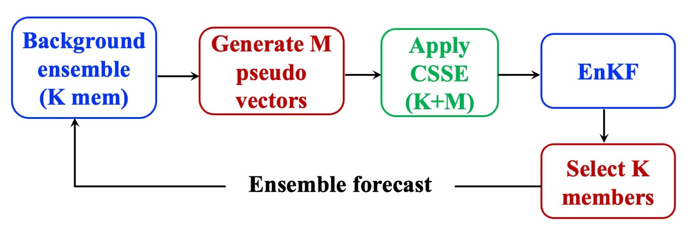
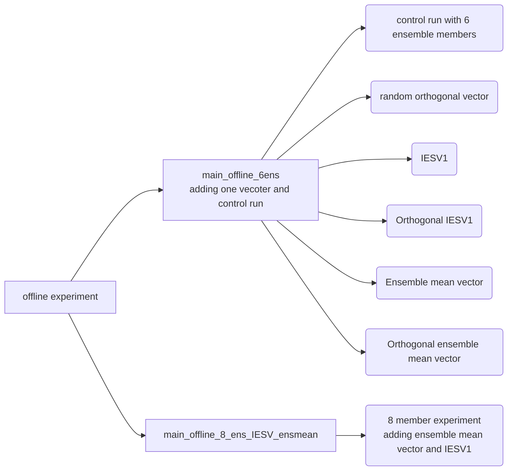
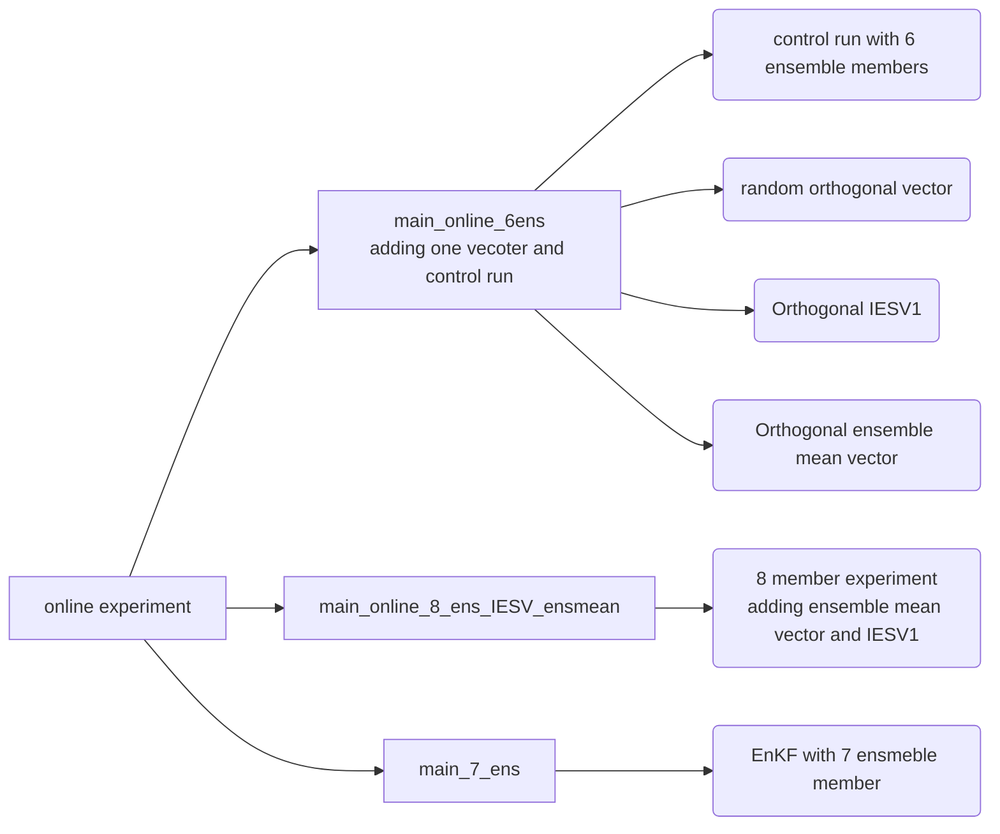
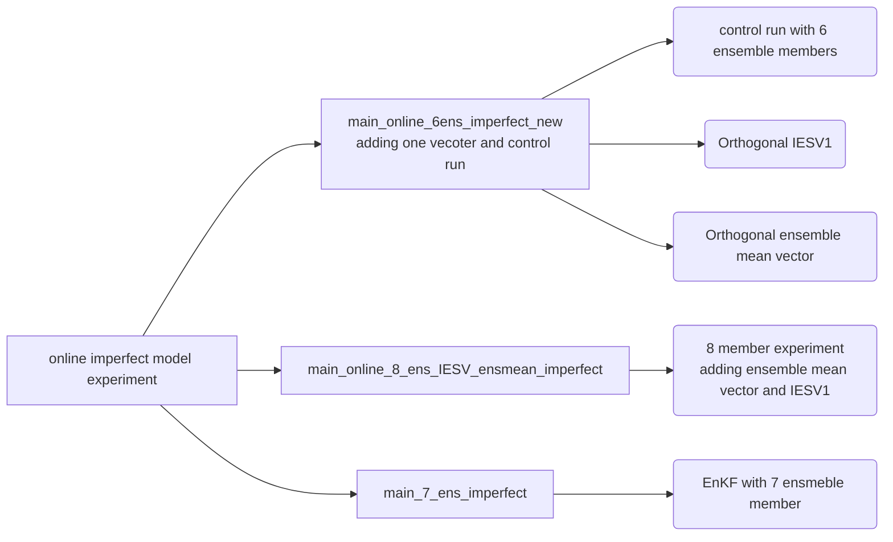

# DOI
[](https://zenodo.org/badge/latestdoi/557688796)

# Using orthogonal vector to improve the ensemble space of the EnKF and its effect on data assimilation and forecasting
This repository is the official implementation of the increased-size EnKF system by using the orthogonal vector to improve the EnKF performance under the lorenz 96 model.


## Requirements
Software requirement: Matlab 2017a

To install libraries:
1. go to the SPROUT folder
```
sprout.initializer
```
2. back to the main_code folder

## Run experiments

1. This repository offers 3 kinds of experiment: 
- offline experiment
- online  experiment
- online imperfect model experiment

2. the offline experiments

3. the online experiment


4. the online imperfect model experiment

### after finish the main.m 
`da_run`  : control run
`da2_run` : experiment


# analysis
All analysis needs to be started from the RMSE_count.m or RMSE_count_imperfect.m

### in figure folder
1. figure2: projection_time_local_max.m
2. figure3: projection_time_local_max.m + improvement_time_local_max
3. figure4: cosIESV1_ensmean_leave_F_T.m
4. figure5 and 6 :plot_svd_for_RMSE.m

## the experiment data could be reproduced by the code


